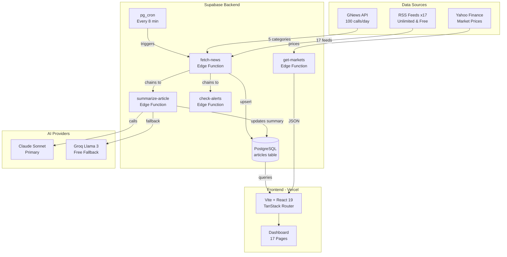
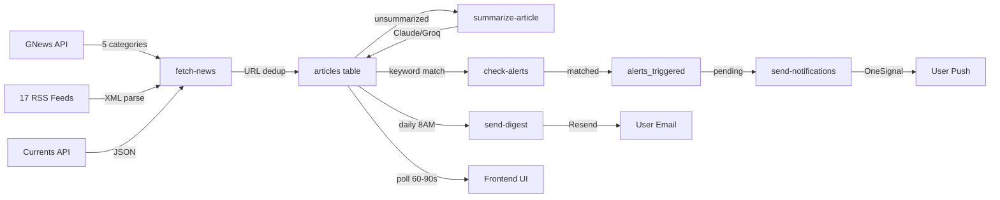
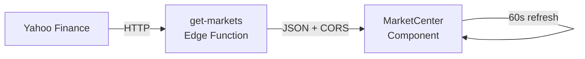

# Insight — Complete Project Documentation

> **Everything important. Nothing unnecessary.**
> A personal intelligence dashboard for real-time news across markets, technology, science, and global events.

**Live URL:** [https://insight-news-ruddy.vercel.app](https://insight-news-ruddy.vercel.app)
**Repository:** [https://github.com/Piy26ush/insight-news](https://github.com/Piy26ush/insight-news..git)

---

## Table of Contents

1. [Architecture Overview](#1-architecture-overview)
2. [Tech Stack](#2-tech-stack)
3. [Project Structure](#3-project-structure)
4. [Database Schema](#4-database-schema)
5. [Edge Functions (Backend)](#5-edge-functions-backend)
6. [Frontend Pages & Components](#6-frontend-pages--components)
7. [Data Pipeline](#7-data-pipeline)
8. [API Quota Management](#8-api-quota-management)
9. [Cron Scheduling](#9-cron-scheduling)
10. [Environment Variables](#10-environment-variables)
11. [Deployment](#11-deployment)
12. [Current Implementation Plan](#12-current-implementation-plan)
13. [Future Roadmap](#13-future-roadmap)

---

## 1. Architecture Overview



**Data Flow:**
1. **pg_cron** triggers `fetch-news` every 8 minutes
2. `fetch-news` pulls from GNews API (5 categories) + 17 RSS feeds
3. Articles are deduplicated by URL and upserted into PostgreSQL
4. `summarize-article` is chained to generate AI summaries (Claude → Groq fallback)
5. `check-alerts` is chained to match user keyword alerts
6. Frontend polls the database every 90 seconds for fresh articles
7. `get-markets` Edge Function fetches live Yahoo Finance prices every 60s from the client

---

## 2. Tech Stack

### Frontend
| Technology | Version | Purpose |
|---|---|---|
| **React** | 19.2 | UI framework |
| **TanStack Router** | 1.168 | File-based routing with SSR support |
| **TanStack Start** | 1.167 | SSR/SSG framework |
| **TanStack React Query** | 5.83 | Server state management |
| **Vite** | 7.3 | Build tool & dev server |
| **TailwindCSS** | 4.2 | Utility-first CSS |
| **Radix UI** | Latest | Accessible component primitives (30+ components) |
| **Lucide React** | 0.575 | Icon library |
| **Recharts** | 2.15 | Charts & data visualization |
| **Sonner** | 2.0 | Toast notifications |
| **date-fns** | 4.1 | Date utilities |
| **Zod** | 3.24 | Schema validation |
| **TypeScript** | 5.8 | Type safety |

### Backend
| Technology | Purpose |
|---|---|
| **Supabase** | PostgreSQL database, Auth, Edge Functions, Realtime |
| **Deno** | Edge Function runtime (server-side TypeScript) |
| **pg_cron** | Scheduled background jobs |
| **pg_net** | HTTP calls from PostgreSQL |

### AI
| Provider | Model | Purpose |
|---|---|---|
| **Anthropic Claude** | claude-sonnet-4-6 | Primary article summarization |
| **Groq** | llama3-8b-8192 | Free fallback summarization |

### Infrastructure
| Service | Purpose |
|---|---|
| **Vercel** | Frontend hosting, auto-deploy from GitHub |
| **Supabase Cloud** | Database, Edge Functions, Auth |
| **GitHub** | Source control, CI/CD trigger |

### Fonts
- **Inter** (400, 500, 600, 700) — UI text
- **JetBrains Mono** (400, 500) — Monospace/code/data

---

## 3. Project Structure

```
clarity-focus-grid-main/
├── public/
│   └── logo.png                        # Brand logo (Insight wave icon)
├── src/
│   ├── components/
│   │   ├── insight/                    # App-specific components
│   │   │   ├── AppSidebar.tsx          # Navigation sidebar with logo
│   │   │   ├── BreakingBanner.tsx      # Scrolling breaking news ticker
│   │   │   ├── CategoryView.tsx        # Reusable category page template
│   │   │   ├── FeedCard.tsx            # Article card with Google News parser
│   │   │   ├── GlobalSnapshot.tsx      # World regions at a glance
│   │   │   ├── ImportantEvents.tsx     # Top 10 important events
│   │   │   ├── MarketCenter.tsx        # Live market indices (Yahoo Finance)
│   │   │   ├── PageShell.tsx           # Page layout wrapper
│   │   │   ├── SectionHeader.tsx       # Section title component
│   │   │   ├── StatCard.tsx            # Overview stat card
│   │   │   ├── TechScienceCards.tsx    # Tech, Science, Vehicle cards
│   │   │   ├── TopHeader.tsx           # Top bar (search, time, refresh, theme)
│   │   │   └── TrendingTopics.tsx      # Trending topics sidebar
│   │   └── ui/                         # 30+ Radix UI primitives (shadcn/ui)
│   ├── hooks/
│   │   └── use-mobile.tsx              # Mobile detection hook
│   ├── lib/
│   │   ├── ai.ts                       # Claude/Groq AI helper (server-side)
│   │   ├── category-mapper.ts          # Category keyword classification
│   │   ├── config.server.ts            # Server-side config
│   │   ├── database.types.ts           # TypeScript types for DB schema
│   │   ├── mock-data.ts                # Fallback mock data for all sections
│   │   ├── supabase.ts                 # Supabase client + all DB helper functions
│   │   └── utils.ts                    # Utility functions (cn, etc.)
│   ├── routes/                         # TanStack file-based routes (17 pages)
│   │   ├── __root.tsx                  # Root layout (sidebar + header + outlet)
│   │   ├── index.tsx                   # Dashboard (main page)
│   │   ├── breaking.tsx                # Breaking news
│   │   ├── technology.tsx              # Technology & AI
│   │   ├── markets.tsx                 # Markets & finance
│   │   ├── india.tsx                   # India news
│   │   ├── world.tsx                   # World news
│   │   ├── science.tsx                 # Science & discovery
│   │   ├── business.tsx                # Business
│   │   ├── cybersecurity.tsx           # Cybersecurity
│   │   ├── sports.tsx                  # Sports
│   │   ├── vehicles.tsx                # Vehicles & mobility
│   │   ├── search.tsx                  # Search page
│   │   ├── saved.tsx                   # Saved/bookmarked articles
│   │   ├── notifications.tsx           # Keyword alert notifications
│   │   └── settings.tsx                # User preferences
│   ├── styles.css                      # Global CSS (design tokens, animations)
│   ├── router.tsx                      # Router configuration
│   ├── server.ts                       # SSR server entry
│   └── start.ts                        # App entry point
├── supabase/
│   ├── functions/                      # 8 Deno Edge Functions
│   │   ├── fetch-news/index.ts         # Main news fetcher (GNews + RSS)
│   │   ├── get-articles/index.ts       # Article query API
│   │   ├── get-markets/index.ts        # Live Yahoo Finance prices
│   │   ├── summarize-article/index.ts  # AI article summarizer
│   │   ├── check-alerts/index.ts       # Keyword alert matcher
│   │   ├── send-notifications/index.ts # Push notification sender
│   │   ├── send-digest/index.ts        # Daily email digest
│   │   └── ping/index.ts              # Health check / keep-alive
│   └── migrations/                     # SQL migration files
│       ├── 001_initial_schema.sql      # Core tables + RLS
│       ├── 002_api_meta.sql            # API call tracking
│       ├── 003_alerts_triggered.sql    # Alert notification log
│       └── 004_cron_jobs.sql           # Cron job registration
├── .env                                # Local environment variables
├── .env.example                        # Template for environment variables
├── DEPLOYMENT.md                       # Deployment guide
├── package.json                        # Dependencies (473 packages)
├── vite.config.ts                      # Vite + TanStack Start config
└── tsconfig.json                       # TypeScript config
```

**Codebase Size:** ~8,500 lines frontend + ~1,950 lines backend = **~10,450 lines total**

---

## 4. Database Schema

### Tables

#### `articles` — Core news storage
| Column | Type | Description |
|---|---|---|
| `id` | UUID (PK) | Auto-generated |
| `title` | TEXT | Article headline |
| `summary` | TEXT (nullable) | AI-generated summary |
| `url` | TEXT (UNIQUE) | Deduplicated on this |
| `source` | TEXT | Publisher name (e.g., "Reuters", "NDTV") |
| `category` | TEXT | AI \| Tech \| Science \| Markets \| Global |
| `sentiment` | TEXT (nullable) | bullish \| bearish \| neutral (Markets only) |
| `published_at` | TIMESTAMPTZ | When article was published |
| `fetched_at` | TIMESTAMPTZ | When we ingested it |
| `image_url` | TEXT (nullable) | Thumbnail URL |

**Indexes:** `category`, `published_at DESC`, `url`, `fetched_at DESC`

#### `user_alerts` — Keyword watch rules
| Column | Type | Description |
|---|---|---|
| `id` | UUID (PK) | Auto-generated |
| `user_id` | UUID (FK → auth.users) | Owner |
| `keyword` | TEXT | e.g., "OpenAI", "Nifty" |
| `category` | TEXT (nullable) | Optional: only match in this category |
| `is_active` | BOOLEAN | Toggle on/off |
| `created_at` | TIMESTAMPTZ | Created timestamp |

#### `saved_articles` — Bookmarks
| Column | Type | Description |
|---|---|---|
| `id` | UUID (PK) | Auto-generated |
| `user_id` | UUID (FK → auth.users) | Owner |
| `article_id` | UUID (FK → articles) | Bookmarked article |
| `saved_at` | TIMESTAMPTZ | When saved |

**Constraint:** UNIQUE(user_id, article_id)

#### `user_preferences` — Personalization
| Column | Type | Description |
|---|---|---|
| `user_id` | UUID (PK, FK → auth.users) | 1:1 with user |
| `preferred_categories` | TEXT[] | Default: all 5 categories |
| `theme` | TEXT | 'dark' \| 'light' |
| `digest_enabled` | BOOLEAN | Daily email digest toggle |
| `updated_at` | TIMESTAMPTZ | Auto-updated via trigger |

#### `alerts_triggered` — Notification log
| Column | Type | Description |
|---|---|---|
| `id` | UUID (PK) | Auto-generated |
| `user_id` | UUID (FK) | Alert owner |
| `article_id` | UUID (FK) | Matched article |
| `keyword` | TEXT | The keyword that matched |
| `triggered_at` | TIMESTAMPTZ | When matched |
| `notified_at` | TIMESTAMPTZ (nullable) | NULL until notification sent |

#### `api_call_log` — Rate limit tracking
| Column | Type | Description |
|---|---|---|
| `source` | TEXT | 'gnews' \| 'currents' \| 'rss' |
| `call_date` | DATE | Today's date |
| `call_count` | INTEGER | Calls made today |
| `last_called_at` | TIMESTAMPTZ | Most recent call |

**Helper functions:** `increment_api_calls(source)`, `get_api_call_count(source)`

### Row Level Security (RLS)
- **articles:** Public read, service-role write
- **user_alerts / saved_articles / user_preferences:** Users can only CRUD their own rows
- **api_call_log / alerts_triggered:** Service-role only

---

## 5. Edge Functions (Backend)

### [fetch-news](file:///Users/piyush/Desktop/NEWS/clarity-focus-grid-main/supabase/functions/fetch-news/index.ts) — Main News Fetcher
- **Trigger:** pg_cron every 8 min (with 50-minute GNews throttling)
- **Sources:** GNews API (5 categories) + RSS feeds (17 feeds) + Currents API
- **Logic:**
  1. Check GNews daily quota (stops at 90 calls) and GNews 50-minute call interval throttling
  2. Fetch all RSS feeds
  3. Fetch Currents API (if key set, stops at 550 calls)
  4. Deduplicate by URL
  5. Upsert into `articles` table in batches of 50
  6. Chain to `summarize-article` for unsummarized articles (max 10)
  7. Chain to `check-alerts` for keyword matching
- **Category classification:** Keyword scoring across AI, Science, Markets, Tech, Global

### [get-markets](file:///Users/piyush/Desktop/NEWS/clarity-focus-grid-main/supabase/functions/get-markets/index.ts) — Live Market Prices
- **Trigger:** Client-side fetch every 60 seconds
- **Source:** Yahoo Finance public chart API
- **Symbols:** Nifty 50, Sensex, Nasdaq, Dow Jones, Gold, Silver, Crude Oil, USD/INR
- **Returns:** `{ symbol, name, price, change, changePct }` array
- **CORS:** Open (`*`), cached 30 seconds

### [summarize-article](file:///Users/piyush/Desktop/NEWS/clarity-focus-grid-main/supabase/functions/summarize-article/index.ts) — AI Summarizer
- **Trigger:** Chained from `fetch-news` for unsummarized articles
- **AI Strategy:** Claude Sonnet (primary) → Groq Llama 3 (free fallback)
- **Skip logic:** Skips articles that already have a proper summary (unless it's Google News HTML)
- **Output:** 3-sentence summary stored in `articles.summary`

### [check-alerts](file:///Users/piyush/Desktop/NEWS/clarity-focus-grid-main/supabase/functions/check-alerts/index.ts) — Keyword Matcher
- **Trigger:** Chained from `fetch-news`
- **Logic:** Scans recent articles against active user keyword alerts
- **Output:** Inserts matched alerts into `alerts_triggered` table

### [send-notifications](file:///Users/piyush/Desktop/NEWS/clarity-focus-grid-main/supabase/functions/send-notifications/index.ts) — Push Notifications
- **Trigger:** Chained from `check-alerts`
- **Provider:** OneSignal
- **Sends:** Push notifications for matched keyword alerts

### [send-digest](file:///Users/piyush/Desktop/NEWS/clarity-focus-grid-main/supabase/functions/send-digest/index.ts) — Daily Email
- **Trigger:** pg_cron daily at 2:30 AM UTC (8:00 AM IST)
- **Provider:** Resend
- **Content:** Top articles from the last 24 hours

### [get-articles](file:///Users/piyush/Desktop/NEWS/clarity-focus-grid-main/supabase/functions/get-articles/index.ts) — Article Query API
- **Trigger:** On-demand client calls
- **Params:** category, limit, offset
- **Returns:** Filtered, sorted articles

### [ping](file:///Users/piyush/Desktop/NEWS/clarity-focus-grid-main/supabase/functions/ping/index.ts) — Health Check
- **Trigger:** Scheduled every 5 days
- **Purpose:** Keeps Edge Functions warm, prevents cold starts

---

## 6. Frontend Pages & Components

### Pages (17 routes)

| Route | File | Data Source | Auto-Refresh |
|---|---|---|---|
| `/` | [index.tsx](file:///Users/piyush/Desktop/NEWS/clarity-focus-grid-main/src/routes/index.tsx) | All articles (20) | ✅ 90s polling |
| `/breaking` | [breaking.tsx](file:///Users/piyush/Desktop/NEWS/clarity-focus-grid-main/src/routes/breaking.tsx) | Critical/high articles (50) | ✅ 90s polling |
| `/technology` | [technology.tsx](file:///Users/piyush/Desktop/NEWS/clarity-focus-grid-main/src/routes/technology.tsx) | Tech + AI articles (20 each) | ✅ 90s polling |
| `/markets` | [markets.tsx](file:///Users/piyush/Desktop/NEWS/clarity-focus-grid-main/src/routes/markets.tsx) | Markets articles + live prices | ✅ 90s polling |
| `/india` | [india.tsx](file:///Users/piyush/Desktop/NEWS/clarity-focus-grid-main/src/routes/india.tsx) | Articles with "India" in title/summary | ✅ 90s polling |
| `/world` | [world.tsx](file:///Users/piyush/Desktop/NEWS/clarity-focus-grid-main/src/routes/world.tsx) | Global category | ✅ 90s polling |
| `/science` | [science.tsx](file:///Users/piyush/Desktop/NEWS/clarity-focus-grid-main/src/routes/science.tsx) | Science category | ✅ 90s polling |
| `/business` | [business.tsx](file:///Users/piyush/Desktop/NEWS/clarity-focus-grid-main/src/routes/business.tsx) | Markets category (business) | ✅ 90s polling |
| `/cybersecurity` | [cybersecurity.tsx](file:///Users/piyush/Desktop/NEWS/clarity-focus-grid-main/src/routes/cybersecurity.tsx) | Tech category (cybersecurity) | ✅ 90s polling |
| `/sports` | [sports.tsx](file:///Users/piyush/Desktop/NEWS/clarity-focus-grid-main/src/routes/sports.tsx) | Sports articles | ✅ 90s polling |
| `/vehicles` | [vehicles.tsx](file:///Users/piyush/Desktop/NEWS/clarity-focus-grid-main/src/routes/vehicles.tsx) | Vehicles category | ✅ 90s polling |
| `/search` | [search.tsx](file:///Users/piyush/Desktop/NEWS/clarity-focus-grid-main/src/routes/search.tsx) | Full-text search | N/A |
| `/saved` | [saved.tsx](file:///Users/piyush/Desktop/NEWS/clarity-focus-grid-main/src/routes/saved.tsx) | User bookmarks | N/A |
| `/notifications` | [notifications.tsx](file:///Users/piyush/Desktop/NEWS/clarity-focus-grid-main/src/routes/notifications.tsx) | Keyword alerts | N/A |
| `/settings` | [settings.tsx](file:///Users/piyush/Desktop/NEWS/clarity-focus-grid-main/src/routes/settings.tsx) | User preferences | N/A |

### Key Components

| Component | Purpose |
|---|---|
| [AppSidebar](file:///Users/piyush/Desktop/NEWS/clarity-focus-grid-main/src/components/insight/AppSidebar.tsx) | Collapsible navigation with brand logo, sections, and personal links |
| [TopHeader](file:///Users/piyush/Desktop/NEWS/clarity-focus-grid-main/src/components/insight/TopHeader.tsx) | Sticky header with search, live clock (IST), refresh button, theme toggle, notifications |
| [BreakingBanner](file:///Users/piyush/Desktop/NEWS/clarity-focus-grid-main/src/components/insight/BreakingBanner.tsx) | Animated marquee ticker with latest 10 articles, refreshes every 60s |
| [FeedCard](file:///Users/piyush/Desktop/NEWS/clarity-focus-grid-main/src/components/insight/FeedCard.tsx) | Article card with importance badge, source, time, summary, Google News related coverage parser |
| [MarketCenter](file:///Users/piyush/Desktop/NEWS/clarity-focus-grid-main/src/components/insight/MarketCenter.tsx) | 8-tile market grid with live prices from Yahoo Finance, auto-refreshes every 60s |
| [CategoryView](file:///Users/piyush/Desktop/NEWS/clarity-focus-grid-main/src/components/insight/CategoryView.tsx) | Reusable template for 7 category pages (India, World, Science, etc.) |
| [GlobalSnapshot](file:///Users/piyush/Desktop/NEWS/clarity-focus-grid-main/src/components/insight/GlobalSnapshot.tsx) | World regions overview with activity indicators |
| [ImportantEvents](file:///Users/piyush/Desktop/NEWS/clarity-focus-grid-main/src/components/insight/ImportantEvents.tsx) | Top 10 globally impactful events ranked by score |

### Design System
- **Theme:** Dark mode default with light mode toggle
- **Colors:** oklch color space with CSS custom properties
- **Animations:** `animate-ticker` (marquee), `animate-pulse-dot` (live indicators), glassmorphism panels
- **Typography:** Inter (UI) + JetBrains Mono (data/timestamps)
- **Layout:** Collapsible sidebar + sticky header + responsive content area (max 1600px)

---

## 7. Data Pipeline

### News Article Lifecycle



### Market Data Lifecycle



---

## 8. API Quota Management

### Current Daily Limits

| API | Free Quota | Our Usage | Guard |
|---|---|---|---|
| **GNews** | 100 calls/day | 5 calls × ~18 cycles = ~90 | Stops at 90 calls |
| **Currents** | 600 calls/day | ~1 call per cycle = ~27 | Stops at 550 calls |
| **RSS** | ∞ Unlimited | 17 feeds × ~27 cycles = ~459 | No limit |
| **Yahoo Finance** | Soft limit (public) | ~1440 calls/day (from clients) | 30s cache |
| **Claude** | Pay-per-use | ~10 summaries per cycle | 15s timeout, Groq fallback |
| **Groq** | Unlimited free | Fallback only | 15s timeout |

### Rate Limit Implementation
- `api_call_log` table tracks calls per source per day
- `get_api_call_count()` SQL function checks today's count
- `increment_api_calls()` SQL function atomically increments
- `fetch-news` checks count before calling each paid API
- If over limit → gracefully skips to RSS-only mode

---

## 9. Cron Scheduling

### Active Cron Jobs (pg_cron)

| Job | Schedule | Function | Notes |
|---|---|---|---|
| `fetch-news-every-8min` | `*/8 * * * *` | fetch-news | Runs every 8 min (RSS: 8m, GNews: 50m limit) |
| `send-daily-digest` | `30 2 * * *` | send-digest | 8:00 AM IST |

---

## 10. Environment Variables

### Frontend (VITE_ prefix, exposed to browser)
| Variable | Description |
|---|---|
| `VITE_SUPABASE_URL` | Supabase project URL |
| `VITE_SUPABASE_ANON_KEY` | Supabase publishable (anon) key |

### Backend (Edge Function secrets)
| Variable | Description |
|---|---|
| `SUPABASE_URL` | Same project URL (auto-set by Supabase) |
| `SUPABASE_SERVICE_ROLE_KEY` | Service role key (bypasses RLS) |
| `GNEWS_API_KEY` | GNews API key (100 req/day free) |
| `CURRENTS_API_KEY` | Currents API key (600 req/day free) |
| `ANTHROPIC_API_KEY` | Claude API key (paid) |
| `GROQ_API_KEY` | Groq API key (free unlimited) |
| `ONESIGNAL_APP_ID` | OneSignal app ID for push notifications |
| `ONESIGNAL_API_KEY` | OneSignal REST API key |
| `RESEND_API_KEY` | Resend email API key |

---

## 11. Deployment

### Vercel (Frontend)
- **Trigger:** `git push origin main` auto-deploys
- **Build:** `vite build` via @lovable.dev/vite-tanstack-config
- **Runtime:** Cloudflare (SSR via Nitro)
- **Env vars:** Set in Vercel dashboard (`VITE_SUPABASE_URL`, `VITE_SUPABASE_ANON_KEY`)

### Supabase (Backend)
- **Edge Functions:** Deploy via `npx supabase functions deploy <name> --no-verify-jwt`
- **Migrations:** Run SQL files in Supabase SQL Editor
- **Secrets:** Set via `supabase secrets set KEY=VALUE`
- **Project ref:** `qxirwthrcmxkaqalzpom`

### Git History (Key Commits)
| Commit | Description |
|---|---|
| `faec72e` | Initial commit |
| `897daa2` | Add @supabase/supabase-js dependency |
| `e8dcaee` | Enable nitro build for Vercel deployment |
| `9385f23` | Update mock market ticks, add clickable headlines |
| `f444049` | Parse Google News coverage links, improve summarization |
| `d688652` | Update cron to fetch news every 1 min |
| `da4b589` | Dynamic BreakingBanner with live articles |
| `f0d4072` | Connect MarketCenter to live Yahoo Finance |
| `a00b6ad` | Format codebase with Prettier |
| `9dc7680` | Add brand logo to sidebar |

---

## 12. Current Implementation Plan

### Goal
Maximize news freshness to feel as real-time as Moneycontrol or Google News, while staying within free-tier API limits.

### Changes (In Progress)

#### A. Expand RSS Feeds (6 → 17)
Add 11 new free, unlimited RSS feeds:
- **India:** NDTV, Times of India, Indian Express, Hindustan Times, Google News India
- **Markets:** Moneycontrol, LiveMint
- **Sports:** ESPN Cricinfo, Google News Sports
- **Science/Health:** Wired Science, Google News Health

#### B. RSS Quality Improvements
1. **Parallel fetching** — `Promise.allSettled()` for all 17 feeds (5× faster)
2. **Fuzzy title dedup** — catch "same story, different URL" duplicates
3. **Smart source extraction** — parse real publisher from Google News HTML
4. **Better image extraction** — `media:content` → `enclosure` → `` fallback
5. **Google News description cleanup** — extract clean text from `<ol><li>` HTML
6. **Expanded category keywords** — India-specific: cricket, IPL, Modi, RBI, SEBI, etc.
7. **Time-based GNews skip** — before 12:00 PM IST = RSS-only (saves all 90 GNews calls for noon → 4 AM)

#### C. Cron Schedule → Every 8 Minutes (with Throttling)
- RSS feeds run every 8 minutes (unlimited and free, keeping news extremely fresh)
- GNews API queries are throttled to run at most once every 50 minutes, and only after 12:00 PM IST
- SQL: `*/8 * * * *`

#### D. Frontend Auto-Refresh on ALL Pages
- Add 90-second `setInterval` polling to:
  - CategoryView (7 pages: India, World, Science, Vehicles, Business, Cybersecurity, Sports)
  - Breaking, Technology, Markets pages
- Currently only Dashboard and BreakingBanner auto-refresh

#### E. Wire Refresh Button (Real Functionality)
- New `refresh-news` Edge Function — **RSS-only** (never touches GNews quota)
- TopHeader refresh button → calls Edge Function → dispatches `CustomEvent("insight:refresh")` → all pages reload data
- Toast notifications: "Fetching…" → "✓ Updated! X new articles"
- 2-minute cooldown to prevent spam

---

## 13. Future Roadmap

### Phase 1: Real-Time Experience (High Priority)

#### 🔴 Supabase Realtime (WebSocket Push)
Replace polling with Supabase's built-in realtime subscriptions:
```
Current:  Cron inserts article → 0-90s wait → frontend polls → shows article
Realtime: Cron inserts article → instant WebSocket push → shows article
```
- Subscribe to `INSERT` events on `articles` table
- Eliminates all polling intervals
- True "live" experience

#### 🟡 "New Articles" Badge (Twitter/X Style)
When new articles arrive via Realtime, show a pill at the top of the feed:
> **↑ 5 new articles — click to load**
- Prevents feed from jumping while reading
- Better UX than auto-shuffling

#### 🟢 Live Relative Timestamps
Make "2m ago" → "3m ago" update in real-time without page refresh:
- `setInterval` every 30 seconds to recalculate relative times
- Currently timestamps are calculated once on load and go stale

### Phase 2: Data Quality (Medium Priority)

#### Auto-Cleanup Old Articles
- Delete articles older than 7 days via nightly pg_cron job
- Keeps database lean and queries fast
- Prevents storage costs from growing

#### Feed Health Monitoring
- Track which RSS feeds fail consistently
- Auto-skip broken feeds after 3 consecutive failures
- Alert in Supabase logs when a feed goes down
- Retry once before giving up

#### Article Trending Score
- If the same story appears in 5+ RSS feeds, boost its importance score
- Cross-reference titles using fuzzy matching
- Makes "truly breaking" stories rise to the top automatically

### Phase 3: Advanced Features (Future)

#### Push Notifications (Already Scaffolded)
- OneSignal integration is built but needs browser permission flow
- Trigger for breaking news keywords
- Settings page toggle is ready

#### Daily Digest Email (Already Scaffolded)
- Resend integration is built
- Need to design email template
- Cron job is registered

#### Offline/Cache Support
- Service Worker to cache last 50 articles
- App works even without internet
- Background sync when connection restored

#### Search Enhancement
- Full-text search across article titles + summaries
- Search history
- Suggested searches based on trending topics

---

## API Quota Optimization Summary

```
┌─────────────────────────────────────────────────────────┐
│                    24-HOUR TIMELINE (IST)                │
├────────────┬────────────────────────────┬────────────────┤
│  5:30 AM   │       12:00 PM            │   3:54 AM      │
│  (quota    │       (GNews starts)       │   (GNews       │
│   resets)  │                            │    exhausted)  │
│            │                            │                │
│  RSS ONLY  │    GNews + RSS (full)      │   RSS ONLY    │
│  (free)    │    (premium quality)       │   (free)      │
│            │                            │                │
│  Still     │    Best quality articles   │   RSS keeps   │
│  captures  │    with images, proper     │   the feed    │
│  morning   │    categories, dedup       │   alive       │
│  news      │                            │                │
├────────────┴────────────────────────────┴────────────────┤
│  Cron interval: 8 minutes (RSS: every 8m, GNews: 50m)    │
│  Manual Refresh: RSS-ONLY always (never burns GNews)    │
│  Frontend Auto-Refresh: Every 90 seconds (all pages)    │
│  Market Prices: Every 60 seconds (Yahoo Finance)        │
└─────────────────────────────────────────────────────────┘
```
